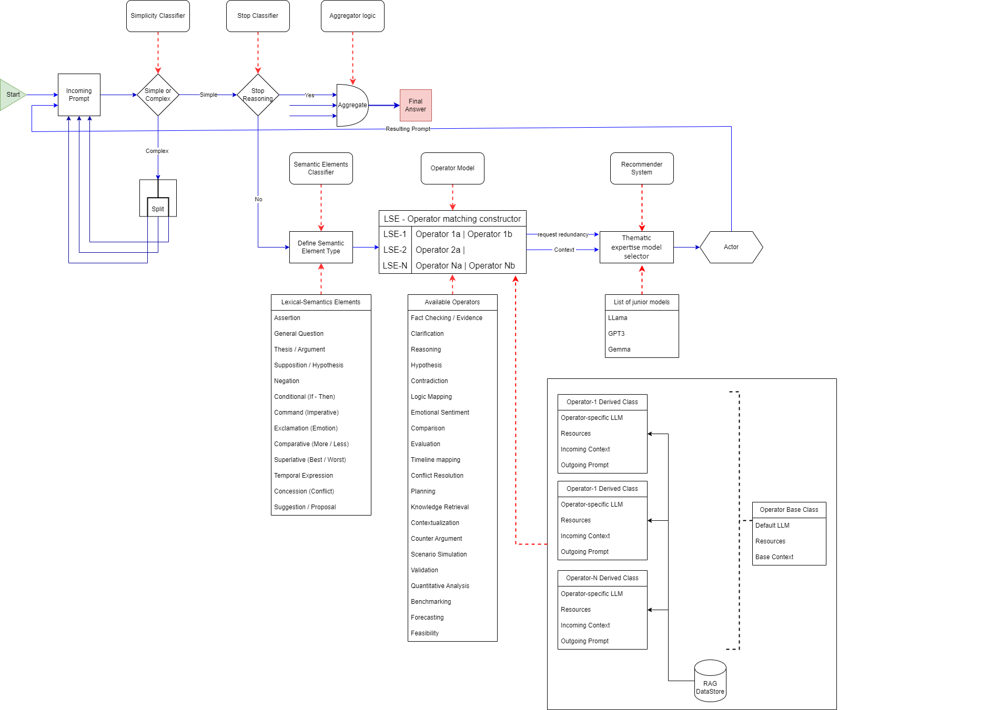

## General Idea - on early implementation stage
(this repo is created for evaluation of new approaches - not a final product)
# SMoA Operator-Based Lexical-Semantic Processing System

## Overview

The **Semantic Model of Action (SMoA)** is a system designed to process complex and simple prompts through an operator-based framework. It employs **Lexical-Semantic Elements (LSE)** and dynamically assigns specialized operators to perform tasks in parallel and asynchronously. The architecture is designed for efficiency, scalability, and domain-specific relevance using junior language models (LLMs).

This repository contains the code and architecture for processing prompts through a graph of interconnected operators, resulting in fast and accurate responses.

## Key Components

1. **Simplicity Classifier**:  
   Analyzes the incoming prompt to classify it as simple or complex. Simple prompts are processed quickly, bypassing advanced operators, while complex prompts are sent for further processing.
   
2. **Splitter**:  
   Breaks down complex prompts into smaller semantic units. Each unit can be processed independently by different operators, allowing for parallel execution.
   
3. **Semantic Elements Classifier**:  
   For each unit, this component determines the appropriate operator (e.g., comparison, analysis, definition) using the LSE matching constructor.
   
4. **Operator Model and Recommender System**:  
   The Operator Model ensures each semantic unit is assigned the correct operator. The Recommender System selects domain-specific junior models based on the prompt's context (e.g., physics, language).
   
5. **Actor**:  
   Manages task flow and branching, ensuring operators receive the appropriate tasks and that the system's results are aggregated efficiently.
   
6. **Aggregator Logic**:  
   Collects responses from all operators and merges them into a coherent final output. This logic also determines when to stop further reasoning.

7. **Parallel and Asynchronous Execution**:  
   Different semantic units are processed simultaneously by the appropriate operators. This drastically reduces response time by maximizing CPU and memory utilization.

8. **RAG DataStore**:  
   Integrates retrieval-augmented generation (RAG) techniques to fetch real-time or domain-specific data, aiding junior models in generating relevant responses.

## Architecture

The architecture is designed to:
- **Optimize Resource Use**: By classifying and routing prompts early, resources are efficiently allocated. Simple prompts require fewer operators, while complex ones are split for parallel processing.
- **Parallel and Asynchronous Processing**: Multiple semantic elements can be processed simultaneously, reducing inference time.
- **Scalability**: The system is built to scale, allowing many requests to be processed concurrently.
- **Domain Expertise**: The Recommender System dynamically selects the best junior models based on the domain of the prompt, improving accuracy and relevance.

## Workflow Example

**Prompt**: "Define quantum mechanics and compare it to classical mechanics. Explain its real-world applications."

1. **Simplicity Classifier**: Classifies this prompt as complex.
2. **Splitter**: Breaks it into three semantic units:
   - "Define quantum mechanics."
   - "Compare quantum mechanics to classical mechanics."
   - "Explain the real-world applications of quantum mechanics."
3. **Semantic Elements Classifier**: Assigns these semantic units to different operators (Definition, Comparison, Analysis).
4. **Parallel Processing**: Each unit is processed simultaneously by its respective operator.
5. **Recommender System**: Selects physics-related junior models to enhance operator responses.
6. **Actor**: Manages flow and ensures results are combined in the final stage.
7. **Aggregator**: Merges the results into a final comprehensive answer.

## Implementation with LangChain

- **Simplicity Classifier**: Implemented as a `ZeroShotAgent` that classifies prompts.
- **Splitter**: A `Chain` in LangChain that decomposes complex prompts.
- **Semantic Elements Classifier**: A `ZeroShotAgent` or `Chain` that assigns operators.
- **Operator Model**: Each operator is represented as a `Tool` in LangChain, with dynamic operator selection via the `ToolSelector`.
- **Actor**: A custom agent coordinating operator execution in parallel using `asyncio`.
- **Aggregator Logic**: Gathers results from various tools and forms a final output.
- **RAG DataStore**: Supported by LangChain's `DocumentRetrievalTool`.